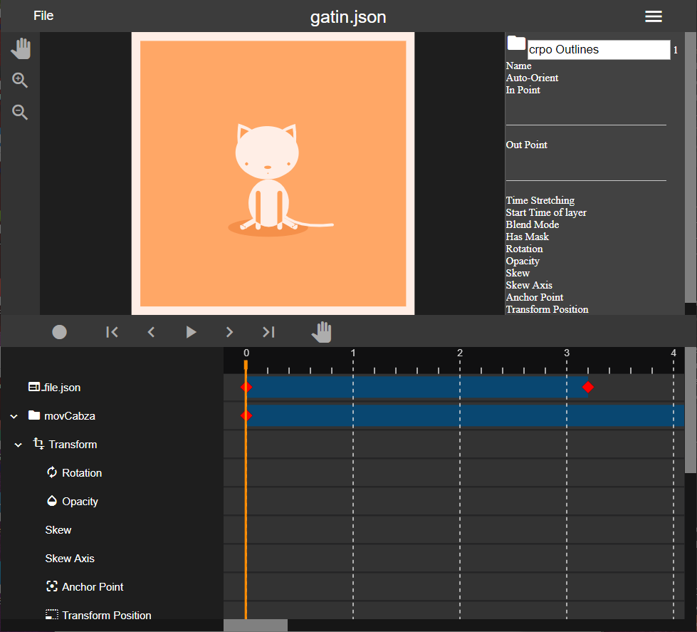

# animator

Suppose to be a simple editor for the lottie animations:

Steps: 
- edit existing transformations with the timeline keyframes <- in progress.
- edit other properties with the timeline.
- import svg.
- easing functions.
- wysiwyg.

Example json file
https://raw.githubusercontent.com/airbnb/lottie-web/master/demo/adrock/data.json